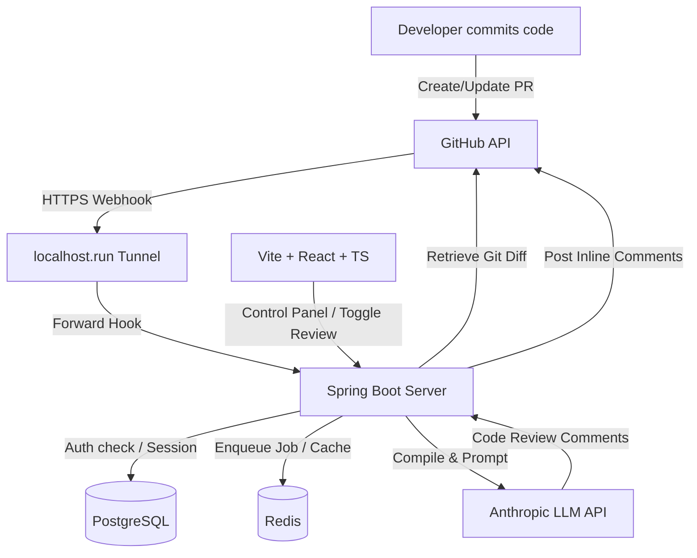

# 🚀 AI Code Reviewer — Interview Prep Guide

This document summarizes the core architecture, key engineering choices, and major technical challenges of the AI PR Reviewer project. Read this to quickly refresh your memory before an interview or system design round.

---

## 📌 The Project Elevator Pitch
"I built an **AI-Powered GitHub Pull Request Reviewer** that automates static code analysis. Whenever a developer opens or updates a Pull Request, GitHub triggers a webhook. Our Spring Boot backend captures the event, fetches the raw git diff, processes it through an asynchronous analysis pipeline, uses the Claude Sonnet LLM via APIs to identify bugs/code smells, and posts inline review comments directly back to the specific lines on GitHub."

---

## 🛠️ System Architecture & Tech Stack

### 1. Backend: Spring Boot 3.x
*   **Why Java/Spring Boot?** Excellent ecosystem for robust REST APIs, enterprise-grade security filtering, and standard concurrency models.
*   **Security**: Customized Spring Security filter chain handling GitHub OAuth2 social logins and processing custom stateless authentication via JSON Web Tokens (JWT).
*   **Database**: **PostgreSQL** handles relational user accounts, repository tracking states, and historical code review reports.
*   **Caching & Queueing**: **Redis** manages OAuth state tokens, distributed session keys, and acts as an asynchronous job queue container for high-throughput webhook events.

### 2. Frontend: Vite + React + TypeScript
*   **Why React & TypeScript?** React enables building responsive SPA dashboards using component-driven state. TypeScript guarantees compile-time type safety.
*   **State Management**: Dynamic component states for listing tracked repositories, searching GitHub profiles, and toggling background automated reviews.

---

## 🔥 Key Technical Challenges (Great "Tell Me About a Time..." Stories)

### 1. The CORS / CSRF Security Loophole
*   **The Problem**: When the React frontend attempted to toggle webhook tracking (making a `POST` or `DELETE` request), the browser blocked the request with a CORS policy error. Under the hood, the backend returned a 302 redirect to GitHub OAuth.
*   **The Cause**: Spring Security has CSRF (Cross-Site Request Forgery) protection enabled by default. Because the frontend uses HttpOnly cookie-based session verification (without sending custom CSRF headers), the CSRF filter intercepted the state-changing request and redirected it to the `/error` path. Since the client was unauthenticated there, the application redirected to the GitHub login URL. Browser AJAX calls (`fetch`) cannot cross origins to login screens due to security sandboxing, triggering the CORS block.
*   **The Solution**: Configured Spring Security's filter chain to explicitly bypass CSRF validation for REST APIs `/api/**` since we rely on custom JWT tokens and HttpOnly session cookies with strict path bindings.

### 2. The Local Webhook Delivery Paradox
*   **The Problem**: Registering a repository webhook requires providing an HTTPS URL to GitHub. Providing `http://localhost:8081` failed with a validation error (`422 Unprocessable Entity`) because GitHub's dispatchers run on the public internet and cannot resolve local loopback addresses.
*   **The Cause**: Webhooks require a public, routable IP/Domain name to deliver HTTP POST request payloads.
*   **The Solution**: Set up a reverse SSH tunnel using `ssh -R 80:localhost:8081 nokey@localhost.run` to bind a public URL (`https://[subdomain].lhr.life`) to the local port, configuring this public endpoint as our dynamic application base URL.

### 3. Java Generic Type Erasure on Payload Parsing
*   **The Problem**: Deserializing JSON requests into a `Map<String, String>` crashed the backend database saving logic with a `ClassCastException` pointing to a `Boolean` conversion failure.
*   **The Cause**: Java's generics are syntactic sugar enforced at compile time but removed at runtime (Type Erasure). Jackson parsed the JSON boolean value `"private": true` into a raw Java `Boolean`. Because of erasure, the JVM allowed the boolean object inside the generic Map. But when accessing it, the compiler attempted an implicit cast to a `String`, crashing the thread.
*   **The Solution**: Changed the method signature to accept `Map<String, Object>` and implemented safe runtime casting (`instanceof Boolean` and `instanceof String`) to ensure type safety.

### 4. effectively-final Constraints inside Java Closures
*   **The Problem**: Attempting to reference and assign boolean values in conditional blocks prior to mapping inside a `.orElseGet()` lambda caused compilation to fail: *“Local variable defined in an enclosing scope must be final or effectively final”*.
*   **The Cause**: Java lambdas/closures capture variables by value, not by reference, to avoid race conditions. Thus, variables inside lambdas must be explicitly marked `final` or never reassigned.
*   **The Solution**: Declared the local configuration variable as `final Boolean isPrivate` and assigned it exactly once across all conditional paths, satisfying closure restrictions.

### 5. RestTemplate Header Stripping on Protocol Downgrade
*   **The Problem**: Hitting the GitHub API returned empty/null data and `500` server errors.
*   **The Cause**:
    1.  The base URL was configured with `http://api.github.com`. GitHub immediately redirected to secure `https://`. During this redirect, Spring's `RestTemplate` stripped the `Authorization` header to prevent leaking API tokens across unencrypted networks.
    2.  GitHub APIs reject requests that lack a standard `User-Agent` header with a `403 Forbidden`.
*   **The Solution**: Swapped the base URL to `https://api.github.com` and appended `User-Agent: AI-PR-Reviewer-App` explicitly to the request configuration.

---

## 💡 Important Design Decisions

### Why HttpOnly Cookies instead of LocalStorage for JWTs?
*   Storing access tokens in `localStorage` makes them vulnerable to **XSS (Cross-Site Scripting)** attacks. If a malicious script runs on the frontend, it can steal the token.
*   By writing the JWT to an **HttpOnly** and **Secure** cookie, the browser automatically attaches it to outgoing API calls, but JavaScript cannot read or write to it, eliminating XSS extraction risk.
