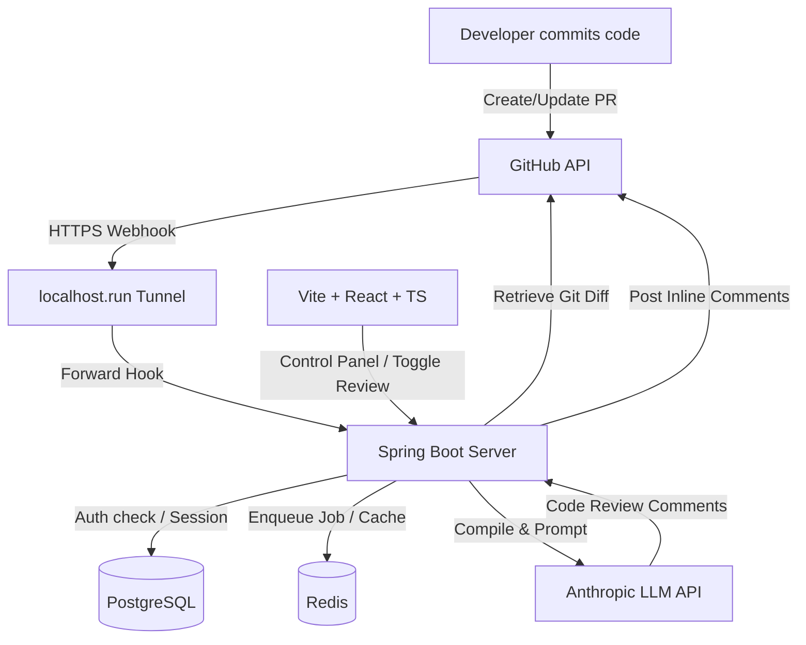

# 🤖 AI-Powered GitHub Pull Request Reviewer

An automated code review agent that listens to GitHub Pull Request webhook events, retrieves raw diffs, runs asynchronous code analysis using the Anthropic Claude API, and posts inline review comments directly to the relevant lines on GitHub.

---

## 🛠️ Tech Stack & Infrastructure

| Component | Technology | Description |
| :--- | :--- | :--- |
| **Backend** | Spring Boot 3.x (Java 21) | REST APIs, custom JWT filter chain, asynchronous review thread pools. |
| **Database** | PostgreSQL | Holds relational user accounts, tracked repositories, pull requests, and review comments. |
| **Caching & Queue** | Redis | Implements distributed lock checks and deduplication guards. |
| **Frontend** | React + Vite + TypeScript | Interactive developer dashboard to control webhooks and browse reviews. |
| **Tunnel Proxy** | localhost.run (SSH Tunnel) | Exposes local backend port `8081` to the public internet for webhook delivery. |
| **AI Model** | Claude 3.5 Sonnet | Performs code analysis, scores commits, and suggests fixes. |

---

## 📋 System Architecture



---

## 🚀 Local Setup & Run Guide

Follow these commands to start the entire developer stack:

### 1. Launch Infrastructure
Start PostgreSQL and Redis in the background:
```bash
docker-compose up -d
```

### 2. Expose the Public Webhook Tunnel
Create a public tunnel forwarding traffic to port `8081` (keep this terminal running):
```bash
ssh -R 80:localhost:8081 nokey@localhost.run
```
*Note: Copy the HTTPS URL generated (e.g. `https://abc.lhr.life`) and set it as `APP_BASE_URL` in your backend `.env` file.*

### 3. Run Backend Server
From the `BackendApplication/BackendApplication` directory:
```bash
./mvnw spring-boot:run
```

### 4. Run Frontend Client
From the `client` directory:
```bash
npm run dev
```

---

## 🔑 Environment Variables Configuration

### Backend Configuration (`.env`)
```env
# GitHub OAuth Credentials
GITHUB_CLIENT_ID=your_oauth_client_id
GITHUB_CLIENT_SECRET=your_oauth_client_secret

# URLs Configuration
FRONTEND_URL=http://localhost:5173
APP_PUBLIC_API_URL=http://localhost:8081
APP_BASE_URL=https://[your-ssh-tunnel-subdomain].lhr.life

# Authentication security
JWT_SECRET=super_secret_key_at_least_32_characters_long
```

### Frontend Configuration (`.env.local`)
```env
VITE_API_URL=http://localhost:8081
```

---

## ⚙️ How it Works (The 5-Step Flow)
1. **Trigger**: Developer opens a Pull Request on a tracked repository.
2. **Delivery**: GitHub sends a cryptographic `POST` payload signed with HMAC-SHA256 to our webhook proxy.
3. **Validation & Locking**: The backend validates the signature, acquires a Redis-based distributed lock to prevent duplicate runs, and checks if a review already exists for the head commit SHA.
4. **Analysis**: The backend fetches the raw PR diff from GitHub, feeds it to Claude 3.5 Sonnet with a strict code review prompt, and parses the structured JSON findings.
5. **Commenting**: Inline reviews are posted line-by-line to GitHub, and a summary score card is committed to the PR thread.
